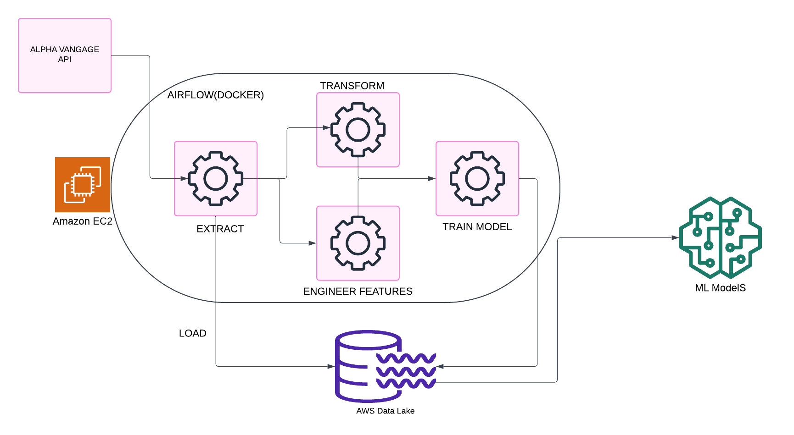
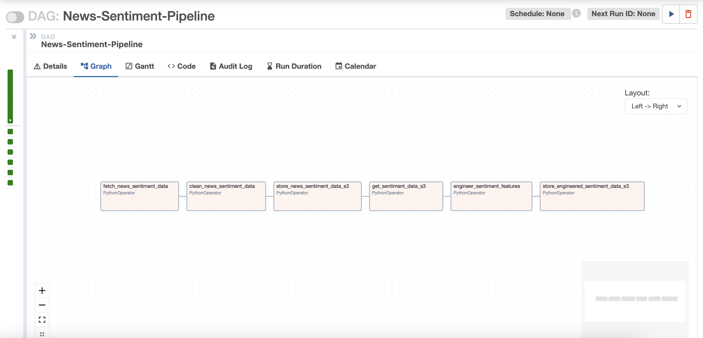

# Stock Data Pipeline for US Companies: Apple, IBM and Google

This repository contains a data pipeline designed to collect, clean, and process historical stock data for Apple (AAPL), IBM, and Google (GOOGL). The pipeline incorporates news sentiment analysis and technical indicators to enhance feature engineering. The final processed dataset is suitable for machine learning models to predict future stock prices.

This Airflow pipeline contains 3 DAGS:

1. Structured data: Stock, Insider Transaction and Technical Indicators data are fetched, cleaned and merged for an ML model.

2. Unstructured data: News Sentiment data is fetched, cleaned and feature engineered for the ML model.

3. Here we combine the datasets from the two pipelines above to train a Machine Learning Model to predict future stock prices. Two models are produced: Random Forest and Hist Gradient Boosting Regressor.

## Environment

Before proceeding to run the code, ensure to create a `.env` file and add the following variables: `AWS_ACCESS_KEY_ID`, `AWS_SECRET_ACCESS_KEY`, `AWS_S3_BUCKET_NAME`.

## Run Data Pipeline

Code available **[here](https://github.com/onubrooks/Stock-Data-News-Sentiment-Pipeline/tree/main?tab=readme-ov-file)** repository.

### Run on codespaces

You can run this data pipeline using GitHub codespaces. Follow the instructions below.

1. Create codespaces by going to the **[data_engineering_project](https://github.com/onubrooks/Stock-Data-News-Sentiment-Pipeline/tree/main?tab=readme-ov-file)** repository, cloning it(or click `Use this template` button) and then clicking on `Create codespaces on main` button.
2. Wait for codespaces to start, then in the terminal type `make up`.
3. Wait for `make up` to complete, and then wait for 30s (for Airflow to start).
4. After 30s go to the `ports` tab and click on the link exposing port `8080` to access Airflow UI (username and password is `airflow`).

### Run locally

To run locally, you need:

1. [git](https://git-scm.com/book/en/v2/Getting-Started-Installing-Git)
2. [Github account](https://github.com/)
3. [Docker](https://docs.docker.com/engine/install/) with at least 4GB of RAM and [Docker Compose](https://docs.docker.com/compose/install/) v1.27.0 or later

Clone the repo and run the following commands to start the data pipeline:

```bash
git clone https://github.com/onubrooks/Stock-Data-News-Sentiment-Pipeline.git
cd Stock-Data-News-Sentiment-Pipeline
make up
sleep 30 # wait for Airflow to start
make ci # run checks and tests
```

Go to [http:localhost:8080](http:localhost:8080) to see the Airflow UI. Username and password are both `airflow`.

## Architecture and Services



This data engineering project includes the following services:

1. **`Airflow`**: To schedule and orchestrate DAGs.
2. **`Postgres`**: To store Airflow's details (which you can see via Airflow UI) and also has a schema to represent upstream databases.
3. **`Amazon S3`**: To act as our warehouse/datalake
4. **`Quarto with Plotly`**: To convert code in `markdown` format to html files that can be embedded in your app or servered as is.
5. **`cuallee`**: To run data quality checks on the data we extracted from AlphaVantage API.
6. **`Amazon EC2`**: To run the pipeline on a cloud virtual machine. This is optional as it can be run locally or on codespaces. It is set up using Terraform

For simplicity services 1, 2, 4 and 5 of the above are installed and run in one container defined [here](./containers/airflow/Dockerfile).

### Stock Data Model Design

Most data teams have their version of the 3-hop architecture. For example, dbt has its own version (stage, intermediate, mart), and Spark has medallion (bronze, silver, gold) architecture.

This project loosely mirrors the medallion architecture, transforming data from raw to cleaned/transformed to the modelled dataset for ML models to consume and finally specialised datasets for end-users.


### Stock Data Flow Architecture and Airflow DAG Workflow

The 3 DAGs in the [Airflow UI](http://localhost:8080) will look like the below images:





#### Data Quality Checks

Note from the first diagram that some data quality checks have been added upon fetching data from the API to check for completeness of certain important columns.

### Running Tests

The tests are available at [./tests](./tests) folder. Run `make ci` to run the tests.

## (Optional) Advanced cloud setup

If you want to run your code on an EC2 instance, with terraform, follow the steps below.

### Prerequisites

1. [Terraform](https://learn.hashicorp.com/tutorials/terraform/install-cli)
2. [AWS account](https://aws.amazon.com/)
3. [AWS CLI installed](https://docs.aws.amazon.com/cli/latest/userguide/install-cliv2.html) and [configured](https://docs.aws.amazon.com/cli/latest/userguide/cli-chap-configure.html)

You can create your GitHub repository based on this template by clicking on the `Use this template button in the Stock-Data-News-Sentiment-Pipeline repository. Clone your repository and replace content in the following files

1. **[CODEOWNERS](https://github.com/onubrooks/Stock-Data-News-Sentiment-Pipeline/blob/main/.github/CODEOWNERS)**: In this file change the user id from `@onubrooks` to your Github user id.
2. **[cd.yml](https://github.com/onubrooks/Stock-Data-News-Sentiment-Pipeline/blob/main/.github/workflows/cd.yml)**: In this file change the `Stock-Data-News-Sentiment-Pipeline` part of the `TARGET` parameter to your repository name.
3. **[variable.tf](https://github.com/onubrooks/Stock-Data-News-Sentiment-Pipeline/blob/main/terraform/variable.tf)**: In this file change the default values for `alert_email_id` and `repo_url` variables with your email and [github repository url](https://www.theserverside.com/blog/Coffee-Talk-Java-News-Stories-and-Opinions/GitHub-URL-find-use-example) respectively.

Run the following commands in your project directory.

```shell
# Create AWS services with Terraform
make tf-init # Only needed on your first terraform run (or if you add new providers)
make infra-up # type in yes after verifying the changes TF will make

# Wait until the EC2 instance is initialized, you can check this via your AWS UI
# See "Status Check" on the EC2 console, it should be "2/2 checks passed" before proceeding
# Wait another 5 mins, Airflow takes a while to start up

make cloud-airflow # this command will forward Airflow port from EC2 to your machine and opens it in the browser
# the user name and password are both airflow

make cloud-metabase # this command will forward Metabase port from EC2 to your machine and opens it in the browser
# use https://github.com/onubrooks/Stock-Data-News-Sentiment-Pipeline/blob/main/env file to connect to the warehouse from metabase
```

For the [continuous delivery](https://github.com/onubrooks/Stock-Data-News-Sentiment-Pipeline/blob/main/.github/workflows/cd.yml) to work, set up the infrastructure with terraform, & defined the following repository secrets. You can set up the repository secrets by going to `Settings > Secrets > Actions > New repository secret`.

1. **`SERVER_SSH_KEY`**: We can get this by running `terraform -chdir=./terraform output -raw private_key` in the project directory and paste the entire content in a new Action secret called SERVER_SSH_KEY.
2. **`REMOTE_HOST`**: Get this by running `terraform -chdir=./terraform output -raw ec2_public_dns` in the project directory.
3. **`REMOTE_USER`**: The value for this is **ubuntu**.

### Tear down infra

After you are done, make sure to destroy your cloud infrastructure.

```shell
make down # Stop docker containers on your computer
make infra-down # type in yes after verifying the changes TF will make
```
